# 2026-10-05: Tooling, renderer choice, first blockout

## Done
- Unity 6000.6.4f1 project opened. MCP for Unity connected to Claude Code (HTTP on `127.0.0.1:8080`).
- Blender 5.2.2 LTS connected through the BlenderMCP addon (port 9876).
- Installed **URP 17.6.0**, **Input System 1.20.1** and **Test Framework 1.8.0**.
- Switched the color space to **Linear** (needed for HDR and PBR) and input handling to the **new Input System**.
- Tripo API key stored in Unity's secure key store. A local copy is in `.secrets/`, which git ignores.
- **Graybox modular kit** built in Blender (`Art_Source/Blender/ENV_TestCorridor.blend`), on the 2 m grid:
  - `ENV_Corridor_Straight_4m`: a 3 m wide, 3 m tall movie-era corridor with angled upper walls, a structural rib, a burgundy accent stripe, a kick plate and a lit ceiling strip
  - `ENV_Bulkhead_Door` + `PROP_Door_Leaf`: a 1.6 × 2.4 m doorway with split sliding doors
  - `ENV_Room_Simulator_8m`: the Academy simulator room, with a viewscreen on the back wall
  - `PROP_Console_Test` + `PROP_Console_Button`: a test console with an emissive screen and a red button
- Test level assembled: turbolift door → 12 m corridor → door → simulator room with the console.

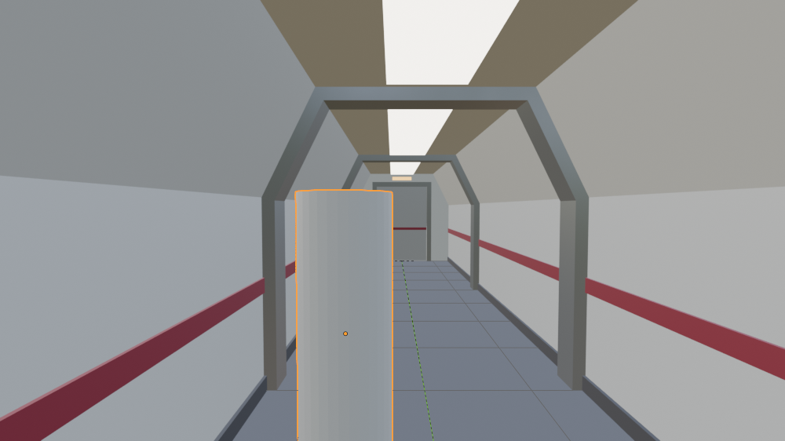
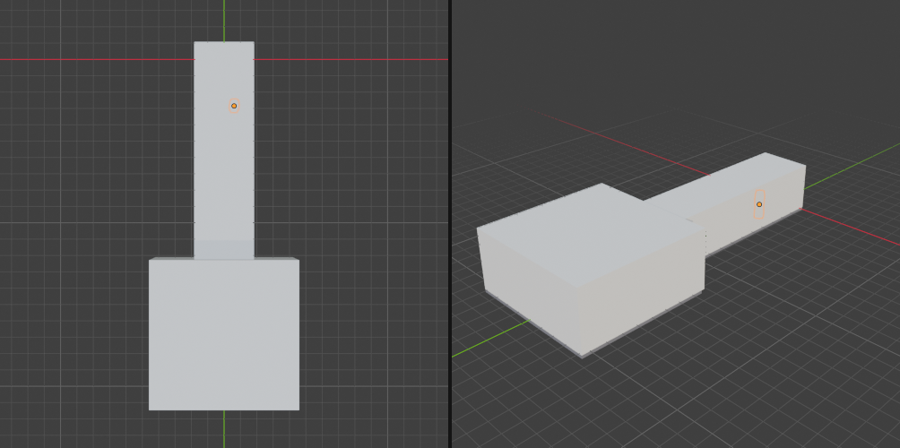

- **URP quality tiers** created by `StarTrek/Setup/Run All` (`Assets/_Project/Editor/ProjectSetup.cs`):
  - **Low** (Editor default, UHD 620): render scale 0.75, no MSAA, 1024 shadows, no SSAO, LDR grading
  - **High** (build default): 2× MSAA, 2048 soft shadows, SSAO, HDR grading
  - **Ultra**: 4× MSAA, 4096 shadows with 4 cascades, SSAO, HDR grading
  - All tiers use HDR with the Forward+ renderer. The global volume adds bloom, ACES tone mapping, color adjustments and a vignette.
- **Gameplay code** (`Assets/_Project/Scripts`, assembly `StarTrek.Runtime`):
  - `FirstPersonController`: walk, sprint, crouch (checks headroom), mouse and gamepad look, Esc to free the cursor
  - `Interactor` + `IInteractable`: look at something within 2.4 m to see a prompt; E or gamepad A uses it
  - `SlidingDoor`: the split doors whoosh open when you approach; locked doors play a denied tone
  - `PushButton` → `AlertController`: the console button toggles **Red Alert** (red pulsing lights and light panels, looping klaxon)
  - `ProceduralSfx`: original placeholder sounds generated in code (door whoosh, chirp, denied, klaxon)
  - `GrayboxHud`: crosshair dot and an amber interaction prompt (temporary)
- **Test scene** `Assets/_Project/Scenes/Test/TestCorridor.unity`, built by `StarTrek/Build Test Corridor Scene` from the Blender export (`Art/Interiors/ENV_TestLevel.glb`). It adds colliders, doors, 7 point lights, post-processing and the player.
- `MaterialLibrary` swaps the imported glTF materials for project-owned **URP Lit** materials in `Assets/_Project/Materials/`, with HDR emission.

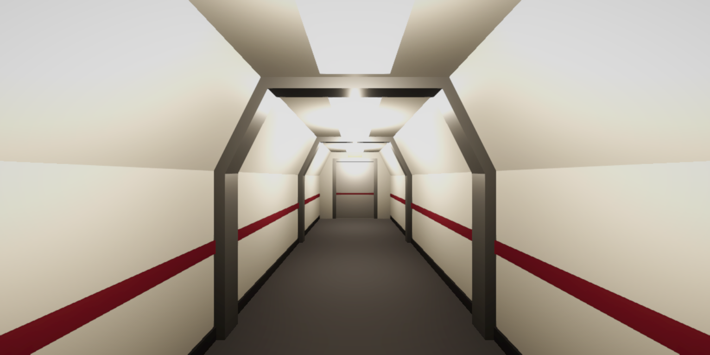

### Play-test (Play mode, driven by simulated Input System key events)
| Check | Result |
|---|---|
| Walk the full corridor with W | ✅ z 1.3 → 16.7 m, stopped by the console's collider |
| Sim-room door opens on approach and closes behind | ✅ leaves slide 0.78 m each; shut again after leaving |
| Locked turbolift door | ✅ HUD shows "[E] Turbolift offline"; E plays the denied tone and the door stays shut |
| Console button → Red Alert | ✅ prompt "Red Alert"; lights and light panels pulse red; klaxon loops |
| Second press → Normal | ✅ warm lights restored, klaxon stops |
| Errors/warnings during normal play | ✅ none |
| Frame rate (Editor, Low tier, UHD 620) | ~110–150 fps |

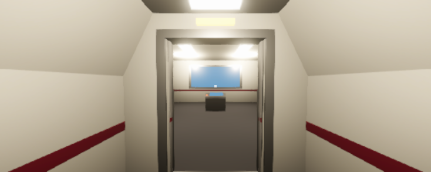
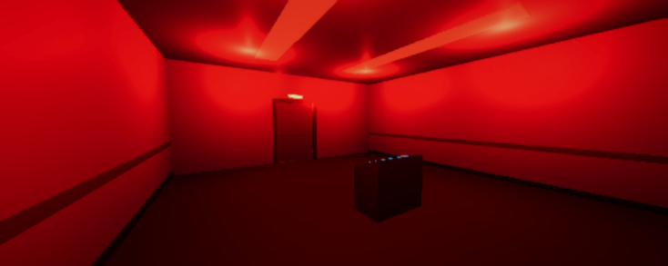
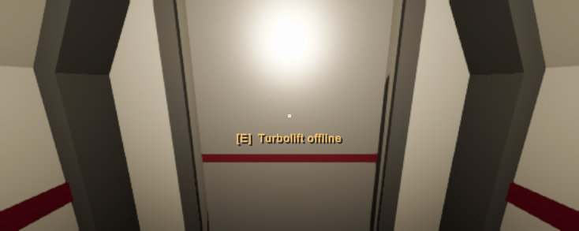

## Decisions
- **No cloud sessions.** All work happens locally, where Unity and Blender are.
- **URP with HDR instead of HDRP.** The dev laptop is an Intel UHD 620, and HDRP would be sluggish on it in both the Editor and the game. URP still gives HDR, bloom, tone mapping, decals and post-processing. `GAME_PROMPT.md` is updated to match.
- Blender source files live in `Art_Source/` (outside `Assets/`), so Unity doesn't try to import .blend files directly.
- Tripo (text/image → 3D) is saved for hero props once the graybox plays well. Tripo can't make 2D concept art here; the Higgsfield connector can.

## Problems
- The UnityMCP entry disappeared from Claude Code's config. Re-adding it with `claude mcp add` and restarting fixed it.
- Kit meshes first came out with one material. Clearing material slots after writing the mesh resets the face assignments; fixed by clearing first.
- glTFast ignores Blender's emission strength (`KHR_materials_emissive_strength`), so the lights imported at 1.0 and didn't bloom. Fixed with `MaterialLibrary` (URP Lit materials with an emission table).
- Python isn't installed on Windows, but that's fine: Blender and the MCP servers bring their own.
- Switching to the new Input System needs an Editor restart. `EditorApplication.OpenProject` and `delayCall` don't fire while Unity is in the background, and `unity close` failed, so the restart was done with `EditorApplication.Exit` and then `unity open`.

- The scene first saved the controls reference as null. `EditorSceneManager.NewScene` unloads unused assets, so the InputActionAsset loaded before it was invalid. Fixed by loading assets after creating the scene.
- The interaction ray hit the player's own capsule (the camera sits inside it). Fixed by putting the player on the Ignore Raycast layer and using `Physics.DefaultRaycastLayers`.
- The simulator viewscreen was blown out to white; its emission dropped from 3 to 0.6.
- MCP for Unity doesn't auto-start its server unless **Auto-Start on Editor Load** is on (Window → MCP for Unity → Advanced). After a reconnect, the running Claude Code session didn't receive the Unity tools, so this session called the server directly over HTTP.
- "PlayerLoop called recursively" warnings appear only while the MCP screenshot tool captures in Play mode, not in normal play.

## Milestone 1 (Foundations) status
URP project with HDR ✅ · quality tiers ✅ · folder structure ✅ · first-person controller ✅ · interaction system ✅. Still to check by hand: mouse and gamepad look feel, crouching under something low, and a standalone build on the laptop.

---

# Milestone 2 (graybox): the refit bridge

## Reference
The movie-era refit bridge is circular, about **9.1 m across** (roughly 7.9 m clear between console edges), and has **two turbolifts**. Around the outside are work stations with overhead screens; in the centre is a lowered command area with the captain's chair and the helm/navigation console, reached by steps at the front. *The Wrath of Khan* darkened the walls, added blinking panels and restyled the front steps.
Sources: [Ex Astris Scientia: Design Issues of the Original Enterprise](https://www.ex-astris-scientia.org/articles/enterprise-issues.htm) · [Ex Astris Scientia: The Enterprise Refit](https://www.ex-astris-scientia.org/articles/constitution-refit.htm) · [Ex Astris Scientia: Re-Used Starship Interiors](https://www.ex-astris-scientia.org/inconsistencies/reused_ship_interiors.htm)

## Done
- **Blender** (`Art_Source/Blender/Interiors_Federation.blend`, which replaces `ENV_TestCorridor.blend` and holds both scenes): the bridge is built from scripts (`st_bridge.py` text block) in scene `SC_Bridge`:
  - wall radius 4.55 m; raised ring 0.45 m high from r = 2.4 m; ceiling at 3.6 m with a raised centre dome (4.1 m) and light rings
  - flat front wall with a 3.7 × 2.05 m UV-mapped viewscreen
  - two turbolift doors (starboard aft at 155°, port aft at 205°), each with split doors and a lift-car alcove behind
  - seven stations: Science, Communications, Environmental, Security, Engineering, Tactical, Damage Control. Each has a sloped console, button row, two overhead displays and a seat.
  - command well: captain's chair (armrest control pads), combined helm/navigation console with two seats, burgundy-padded railing, two-step front stairs on each side
- **Unity**: `StarTrek/Build Bridge Scene` → `Scenes/Ship_Decks/Deck01_Bridge.unity`
  - `Seat`: every chair can be taken (look + E). The view moves to the seat's eye point, looking around is limited to ±110°, and **Space** stands up.
  - Red Alert from the **captain's left armrest** or the **Tactical** button row
  - **Live viewscreen**: a separate space camera on its own `Space` layer renders a procedural starfield (`Starfield`, 2,500 stars) into `RT_Viewscreen`, slowly drifting (`SpaceDrift`)
  - turbolifts locked ("Turbolift offline"); 9 lights plus a blue spill light from the viewscreen
- Red Alert retuned to match the films: lights dim to 30–55% and tint toward red on each pulse, while the ceiling panels flash red.
- Shared builder code moved into `LevelBuildKit`, used by both scene builders.

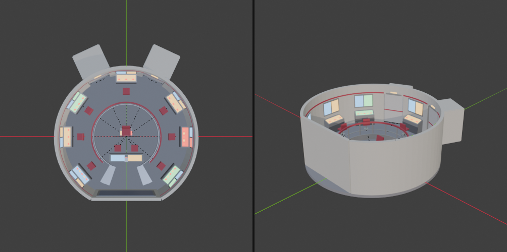
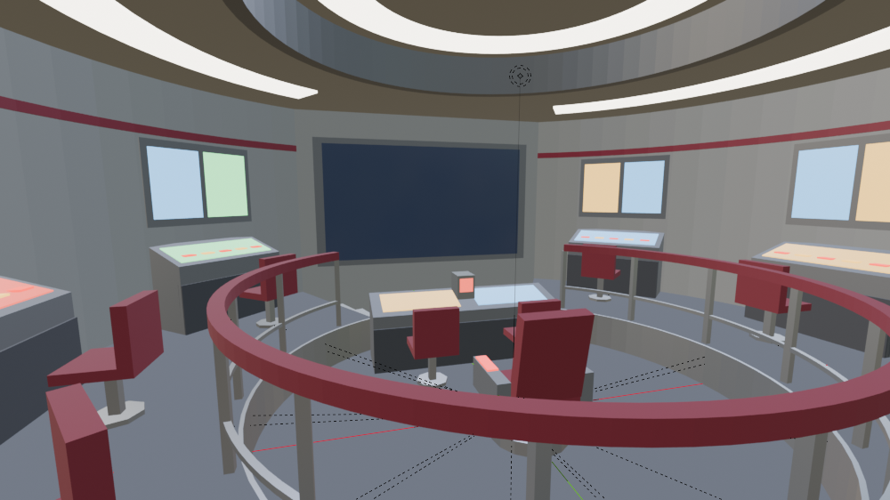
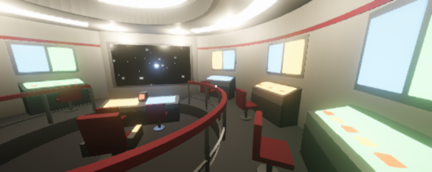
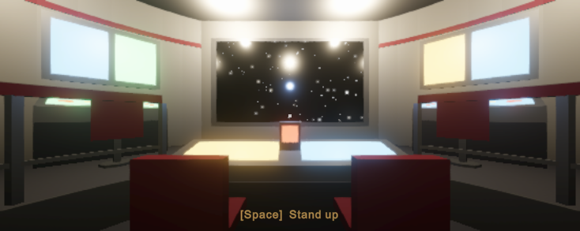
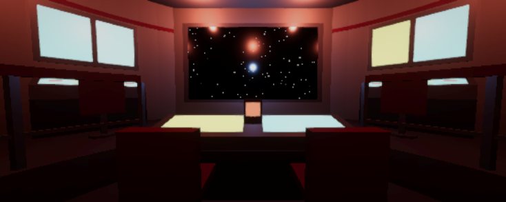
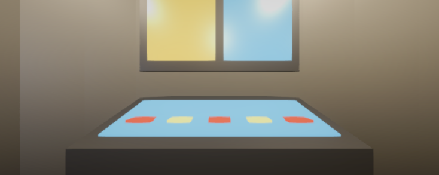

### Play-test
| Check | Result |
|---|---|
| Take the captain's chair (E) | ✅ prompt "Take the captain's chair", seated eye at 1.17 m, "[Space] Stand up" hint |
| Red Alert from the armrest | ✅ |
| Stand up (Space) | ✅ steps out beside the chair, walking re-enabled |
| Sit at Science | ✅ |
| Red Alert from Tactical | ✅ |
| Viewscreen stars drift | ✅ space camera yaw changes over time |
| Corridor scene after the refactor | ✅ rebuilds and plays |
| Frame rate (Editor, Low tier) | ~139 fps with the viewscreen feed |

## Problems
- Station displays washed out to pastels at emission 2.5; lowered to 1.1.
- Seats were first modelled facing the wrong way (station seats, then helm seats); fixed in the builder script.
- The Editor's quick-run compiler is C# 6 (no local functions), which matters for one-off `execute_code` snippets.
- Play mode stopped once in the middle of testing (not caused by our code). Tests now check `isPlaying` at each step.

## Bridge too small: rebuilt bigger
User play-test: *"the bridge is far to small i cannot walk to the seat we need more space to move around"*.
- Measured cause: the ring walkway between the rail and the station seats was **0.53 m**, and the only way into the command well was **0.58 m**. Both are narrower than the 0.6 m player, so the captain's chair could not be reached.
- Rebuilt at **12.8 m across** (wall radius 4.55 → 6.4 m, well 2.4 → 3.4 m, ceiling 3.6 → 4.2 m, viewscreen 5.0 × 2.8 m); consoles and chairs stay real-size. The open front floor is now wider than the screen wall (the ring starts at 45°), and **aft steps** into the well have been added behind the captain's chair.
- New `StarTrek/Check Walkability (open scene)` (`WalkabilityCheck`): bakes a NavMesh for a player-sized agent and checks a path from spawn to every seat and door. It found a second pinch (helm console vs. the ring corner) before the user hit it. Now **PASS 12/12**.
- New `AutoWalker` test helper walks the real controller along the path. **All 10 seats reached** (0.7–1.8 s each).
- Unity only ticks Play mode while its window is focused, so automated play-tests now bring Unity to the front first.

## Next
- Hand play-test of the bridge (sit, look around, Red Alert from the chair)
- Station screens with real content (Starfleet-style UI: our own design, not copied)
- Milestone 3: ship simulation core (power, shields, phasers, torpedoes) and a graybox K't'inga on the viewscreen
